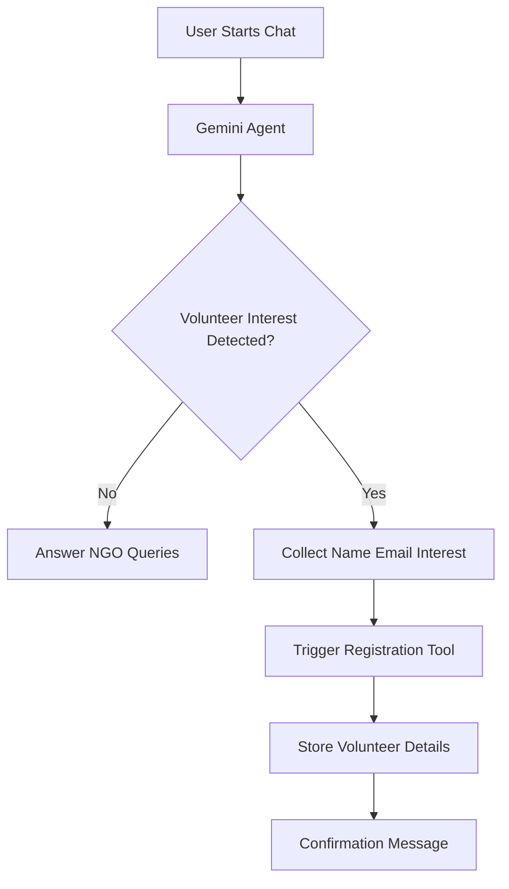

# 🌱 PankhAssist: Smart NGO Volunteer & Inquiry AI Agent

🎨 **Live Demo:** [PankhAssist App](https://nayepankh-ai-agent-sh5eydx2uwdspdfvc2lwnd.streamlit.app/)
🛠️ **Source Code:** [GitHub Repository](https://github.com/shravani22patil/nayepankh-ai-agent)

---

## 📋 Project Overview

Non-Profit Organizations (NGOs) such as **NayePankh Foundation** often manage a large volume of repetitive inquiries from student volunteers, donors, and community partners while operating with limited administrative resources.

**PankhAssist** is an intelligent AI-powered volunteer assistance agent designed to automate volunteer onboarding inquiries, answer organization-related questions, maintain conversation context, and register volunteer information through structured tool calling.

The system functions as a digital helpdesk that reduces manual effort while delivering a smooth and personalized user experience.

---

## 🎯 Key Objectives

✅ **Reduce Operational Overhead**  
Automates volunteer screening and frequently asked questions.

✅ **Structured Data Collection**  
Uses AI-powered function calling to capture volunteer information accurately.

✅ **Context-Aware Conversations**  
Maintains conversational memory throughout the session.

✅ **Lightweight & Cost-Efficient**  
Built with minimal infrastructure while delivering practical impact.

---

## ✨ Features

### 🧠 Persistent Context Management

Unlike traditional stateless chatbots, PankhAssist maintains conversation history using Streamlit session state.

This enables the AI agent to:

- Remember user details across messages
- Maintain context during long conversations
- Deliver more natural interactions

---

### 🔧 Intelligent Tool Calling

The AI agent goes beyond simple text generation by leveraging function calling.

When a user expresses volunteering interest, the model:

1. Collects required details
2. Validates available information
3. Triggers backend functions automatically

Required volunteer information:

- Name
- Email Address
- Interest Area

This ensures structured and reliable data collection.

---

### 🛡️ Graceful Error Handling

The application includes exception management to ensure stability.

If external AI services encounter temporary issues (e.g., HTTP 503 errors), the system:

- Prevents application crashes
- Displays user-friendly messages
- Maintains a smooth user experience

---

## 🛠️ Tech Stack

| Category | Technology |
|-----------|------------|
| Language | Python 3.9+ |
| AI SDK | Google GenAI (`google-genai`) |
| Foundation Model | Gemini 2.5 Flash |
| Frontend | Streamlit |
| State Management | Streamlit Session State |
| Function Calling | Gemini Tool Calling |

---

## 📂 Project Structure

```text
PankhAssist/
│
├── app.py
├── requirements.txt
├── README.md
│
├── assets/
│   └── images
│
└── utils/
    └── volunteer_registration.py
```

---

## 🚀 Local Setup

### 1️⃣ Clone the Repository

```bash
git clone https://github.com/shravani22patil/nayepankh-ai-agent.git

cd nayepankh-ai-agent
```

---

### 2️⃣ Create a Virtual Environment (Recommended)

#### Windows

```bash
python -m venv .venv

.venv\Scripts\activate
```

#### macOS/Linux

```bash
python3 -m venv .venv

source .venv/bin/activate
```

---

### 3️⃣ Install Dependencies

```bash
pip install -r requirements.txt
```

---

### 4️⃣ Configure Gemini API Key

Obtain your API key from **Google AI Studio**.

#### Windows Command Prompt

```cmd
set GEMINI_API_KEY=your_api_key_here
```

#### Windows PowerShell

```powershell
$env:GEMINI_API_KEY="your_api_key_here"
```

#### macOS/Linux

```bash
export GEMINI_API_KEY="your_api_key_here"
```

---

### 5️⃣ Run the Application

```bash
streamlit run app.py
```

The application will launch in your browser at:

```text
http://localhost:8501
```

---

## 🔄 Workflow



---

## 🔮 Future Enhancements

### 📚 Retrieval-Augmented Generation (RAG)

Integrate vector databases such as:

- ChromaDB
- Pinecone
- Weaviate

This would allow the assistant to retrieve information from:

- NGO training manuals
- Volunteer guidelines
- Policy documents
- FAQs

---

### 🤖 Multi-Agent Architecture

Expand into a collaborative multi-agent system using:

- CrewAI
- LangGraph

Potential specialized agents:

- Volunteer Coordinator Agent
- Donor Support Agent
- Social Media Content Agent
- Public Grievance Agent

---

### 🔗 Real CRM Integration

Replace mock registration functions with live integrations:

- Google Sheets API
- Airtable
- Salesforce
- Custom CRM Platforms

---

## 📈 Potential Impact

PankhAssist demonstrates how AI agents can:

- Improve NGO operational efficiency
- Reduce administrative workload
- Increase volunteer engagement
- Provide 24/7 support
- Scale community outreach programs

---

## 👩‍💻 Developer

**Role:** AI Agent Developer Intern

**Focus Areas**

- Generative AI
- Agentic AI Systems
- Retrieval-Augmented Generation (RAG)
- LLM Applications
- AI Automation Workflows

### Connect

- GitHub: https://github.com/shravani22patil
- LinkedIn: https://linkedin.com/in/shravani-patil-38791b286/

---

## 📜 License

This project is intended for educational, research, and social impact purposes.

Feel free to fork, modify, and extend the project while providing appropriate attribution.

---

## ❤️ Acknowledgements

Special thanks to **NayePankh Foundation** for inspiring this project and for its continued efforts toward youth empowerment, education, and social development.

---

> Built with AI to support meaningful social impact.
